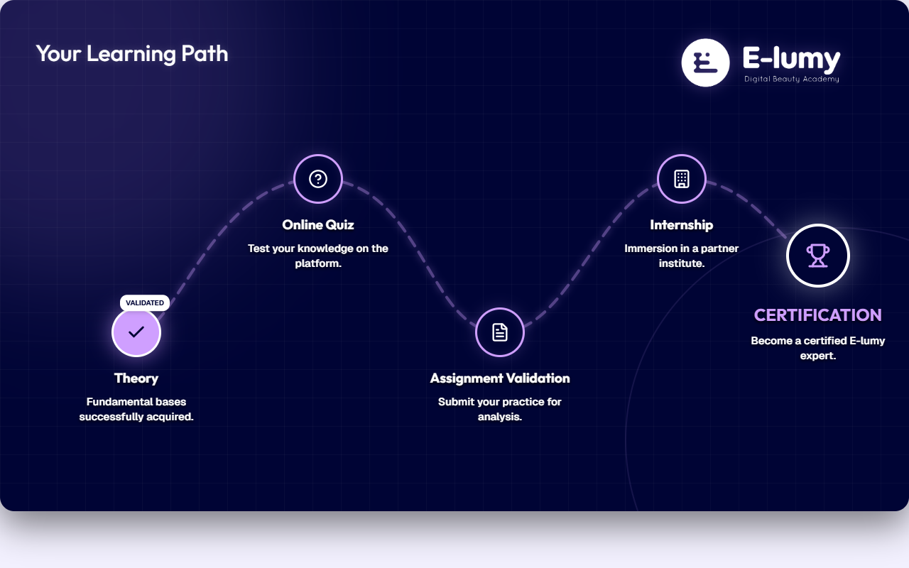

# Learning Path — Shared Final Slide (EN)

**Course:** Lip Blush (EN) · Lash Extensions (EN) · HydraFacial Treatment (EN) · MICRONEEDLING (EN) · Master Relaxing Massage  
**Slide:** Final slide (shared)  
**Live URL:** https://learningpath.edtechiecorp.com  
**Stack:** Next.js · Tailwind CSS · TypeScript · GitHub Pages  

## What this slide does

Shared course completion slide used at the end of multiple English-language courses. Displays the learner's completed learning path and surfaces the next available courses in the EdTechie English curriculum. This slide serves as a retention and upsell mechanism — keeping learners engaged after completing one certification by showing them a clear path to the next one.

## Screenshot

## Usage

This slide is embedded as an iframe inside Coassemble at the live URL above. DNS is managed via Cloudflare (`edtechiecorp.com`). To update the slide, push to the `main` branch — GitHub Actions will rebuild and redeploy automatically.
